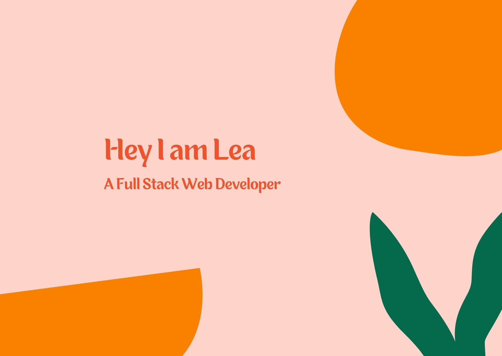

- 🔭 I’m currently looking for an intership of 4-6 months in web development (Full Stack), remotely or in Toulouse city.
- 👩‍💻 I love to learn about tech and how it impacts our world.

## ⚡ What you need to know about me :
- :earth_asia: I am also GIS engineer #geodata and know how to code in Python and use QGIS and ArcGIS. I would love to work on a project that combines both of my passions, although it is not required !
- 

:art: Feel free to contact me here :

